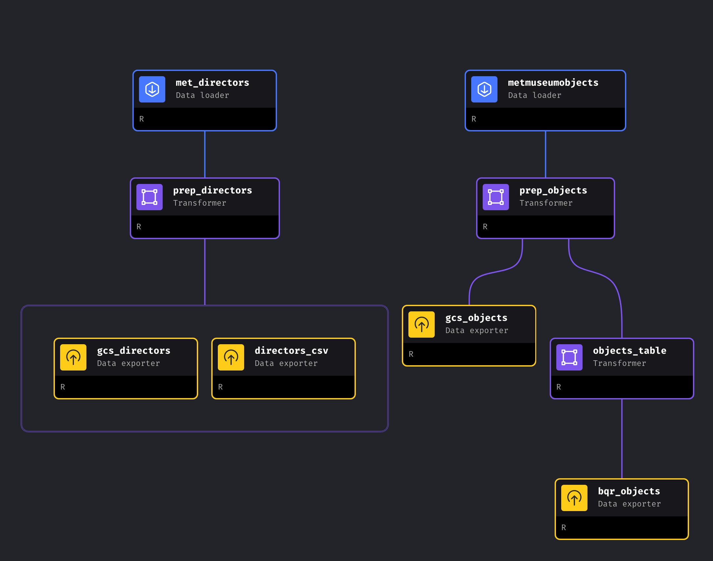
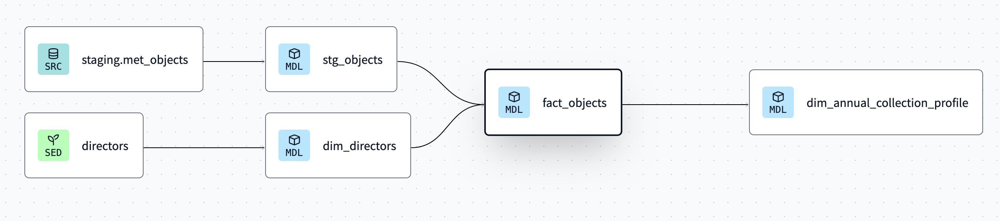
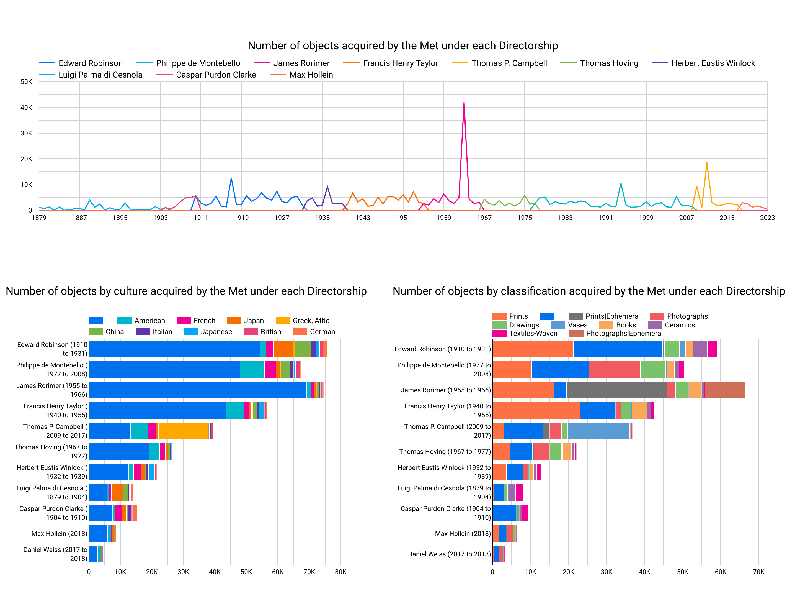

# Analysing How the Met's Collections Evolved Over Time

## Problem
This project analyses [select datasets of information](https://github.com/metmuseum/openaccess) on more than 470,000 artworks in the Collection held by the Metropolitan Museum of Art. The data dictionary can be found on the Met's [API documentation page](https://metmuseum.github.io/#object).

In addition to this vast dataset, I will also scrape [a table of data from Wikipedia](https://en.wikipedia.org/wiki/List_of_directors_of_the_Metropolitan_Museum_of_Art) which lists the Directors of the Met from 1879 to the present day.

The aim of this project is to understand how the nauture of the Met's accessions changed from the tenureship of one Director to the next over more than a century.

## Technologies
* Google cloud platform (GCP):
  * VM Instance to run project.
  * Cloud Storage to store processed data.
  * BigQuery as data source for dashboard.
* Terraform to create cloud infrastructure as code (IaC).
* Docker for containerization, ensuring consistency across different environments.
* R main programming language.
* Mage to orchestrate pipeline jobs.
* dbt to perform transformations.
* Looker Studio to build the dashboard.

## Infrastructure as Code
To get started, [install Terraform](https://developer.hashicorp.com/terraform/tutorials/gcp-get-started/install-cli). The following steps assume that you've followed the **Getting Started** and **Set up GCP sections** of [this tutorial](https://developer.hashicorp.com/terraform/tutorials/gcp-get-started/google-cloud-platform-build) - in other words, you've created a GCP account and installed the gcloud CLI, you've created a new GCP project, and you've enabled the Google Compute Engine API.

Before proceeding, authenticate to Google Cloud:

`gcloud auth application-default login`

Now you're ready to generate a SSH key, which we'll use to connect to our VM after we've created it. Run the following command, preferably under the ~/.ssh directory:

`ssh-keygen -t rsa -f gcp -C ubuntu -b 2048`

Don't bother setting a password when it asks.

Finally, we can run our Terraform script, so `cd` into the terraform directory to proceed.

First we'll need to download the privoders defined in our configuration:

`terraform init`

Now we're ready to create our infrastructure. There are three things you'll need to define by creating a terraform.tfvars file - just add the below into it and fill in the details:

    project = "<YOU-PROJECT-ID>"
    public_key_path = "<PATH-TO-YOUR-GCP.PUB-FILE>"
    private_key_path = "<PATH-TO-YOUR-GCP-FILE>"
    bucket_name = "<YOUR-UNIQUE-GCS-BUCKET-NAME>"

Now we can create the infrastructure:

`terraform apply`

This may take a few minutes, but it will do several things:
* Create a new VM in GCP and...
  * Install Mage through Docker
  * Clone this GitHub repository
* Create a Google Cloud Storage bucket
* Create a BigQuery dataset called "met_museum"

To test your connection to the newly-created VM, run `./connect.sh`. In the VM's console, you can run `ls` to check that the data-eng-project2 directory is listed. Type 'exit' to exit the VM.

## Orchestration

All of the code necessary to acquire the data, perform preprocessing, load it into our GCS bucket, and upload it into BigQuery is handled in [Mage](https://www.mage.ai/). Navigate into the /mage folder, then run:

`docker run -it -p 6789:6789 -v $(pwd):/home/src mageai/mageai /app/run_app.sh mage start mage`

Open http://localhost:6789 in your browser, and you'll find the pipeline to run in here, called `playful_grimoire`. Before you can run the pipeline you'll need to authenticate with GCP, so head over to your GCP console and create a new Service Account under **IAM & Admin**. After filling out the form, you'll download the JSON payload which you can then copy across into the root of the mage folder.

You'll need to make some adjustments to four code blocks to make this work: gcs_objects, gcs_directors, objects_table, and bqr_objects contain references to my .json file, my BQ dataset, and my GCS bucket name that you'll need to replace with yours.

Now you can run the pipeline, which might take some time to execute. Once it's complete, you should have a local CSV file with the Directors data, two CSV files in your GCS bucket (one for objects, one for Directors), and a new table in your BQ dataset called met_objects.

Below is the DAG in its entirety:

## Transformation

Now we can move to [dbt Cloud](https://cloud.getdbt.com/) to execute our models, which will transform the data step-by-step until we get the table we need for our final analysis. Go ahead and create a new project, through which you will connect to your BigQuery dataset and the repository you've cloned (specifically the dbt folder). In the console, run:

`dbt build --vars '{'is_test_run': 'false'}'`

If all goes well, you should have a new dataset in BigQuery with four new tables and a view. Below you can see the DAG in its entirety:

## Dashboard

Finally, the dashboard is created using [Google Looker Studio](https://lookerstudio.google.com/). You're welcome to build your own dashboard as you explore this data, but you can find mine [here](https://lookerstudio.google.com/s/mwlwug7xaS0) and it's been reproduced below:

